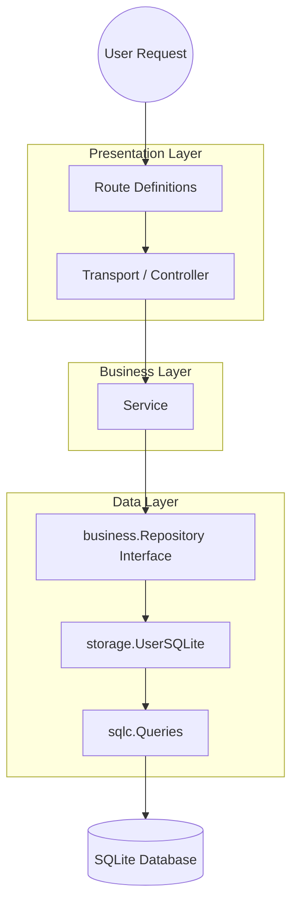

# Contributing to KiwiPanel

Thank you for your interest in contributing to KiwiPanel 🥝! We welcome contributions from the community to help make this the best lightweight server management panel.

## ⚖️ Contributor License Agreement (CLA)

Because KiwiPanel is a dual-licensed project (available under both Community License and Commercial License terms), we need to ensure we have the legal rights to distribute your code in both versions.

By submitting any contribution (including code, documentation, bug fixes, features, comments, or assets), you agree to the following:

1.  **Grant of Rights:** You grant **Vuong Nguyen** (the "Project Owner") the right to use, modify, reproduce, distribute, sublicense, and commercialize your contribution as part of KiwiPanel under any license, including commercial licenses.
2.  **Terms:** This grant is **perpetual, irrevocable, worldwide, and royalty-free**.
3.  **Ownership:** You retain copyright ownership of your contribution (you are just granting us permission to use it).
4.  **Originality:** You confirm that the contribution is your original work or that you have the legal right to submit it.

**By submitting a Pull Request, you automatically accept these terms.**

---

## 🔐 Branch Protection & Code Review

This repository has branch protection enabled on the `main` branch:

- **All changes must be submitted via Pull Request** - Direct pushes to `main` are blocked
- **Code Owner approval required** - All PRs require approval from [@yeungon](https://github.com/yeungon)
- **CI must pass** - Unit tests, builds, and code quality checks must pass before merging
- **Branch must be up-to-date** - PRs must be rebased on the latest `main`

---

## 🏗️ Architecture & Code Flow

To keep the codebase clean and maintainable, KiwiPanel follows a layered architecture. Please adhere to this flow when adding new features.



### Layer Responsibilities

- **Transport (HTTP):** Handles request decoding and validation. No business logic here.
- **Service:** Contains the core business logic (permissions, calculations, workflows).
- **Repository (Interface):** Defines what data allows access to (e.g., GetUser).
- **Storage (Implementation):** The actual SQLite code that satisfies the Repository interface.
- **sqlc:** Generated type-safe SQL code.

---

## 🚀 How to Contribute

### 1. Fork & Clone

```bash
# Fork the repository on GitHub, then:
git clone https://github.com/YOUR_USERNAME/kiwipanel.git
cd kiwipanel
git remote add upstream https://github.com/kiwipanel/kiwipanel.git
```

### 2. Development Database Setup

The development database is stored **outside** the project directory to keep it separate from the codebase:

```
GOLANG/
├── kiwipanel/              ← project root (your working directory)
│   └── internal/app/db.go
└── kiwipanel_dev/          ← create this sibling folder
    └── data/
        └── kiwipanel.db    ← development SQLite database
```

**Setup:**
```bash
# Create the development data directory (sibling to project folder)
mkdir -p ../kiwipanel_dev/data

# Run migrations to create the database
make migrate
```

The path is configured in [`internal/app/db.go`](internal/app/db.go:15) as `../kiwipanel_dev/data/kiwipanel.db`.

> **Note:** Go resolves relative paths from the **current working directory** (where the app runs), not from the source file location. That's why we use `../` to go up one level from the project root.

### 3. Create a Feature Branch

```bash
# Always branch from the latest main
git checkout main
git pull upstream main
git checkout -b feature/amazing-feature
```

**Branch naming conventions:**
- `feature/` - New features (e.g., `feature/user-dashboard`)
- `fix/` - Bug fixes (e.g., `fix/login-error`)
- `docs/` - Documentation updates (e.g., `docs/api-reference`)
- `refactor/` - Code refactoring (e.g., `refactor/auth-module`)

### 3. Make Your Changes

- Follow the architecture guidelines above
- Write tests for new functionality
- Keep commits atomic and well-described

### 4. Run Tests Locally

```bash
# Run all tests
make test

# Run unit tests only
make test-unit

# Run with race detection
make test-race

# Check code formatting
make fmt

# Run linter
make lint
```

### 5. Push and Create PR

```bash
git push origin feature/amazing-feature
```

Then open a Pull Request on GitHub:
1. Go to [kiwipanel/kiwipanel](https://github.com/kiwipanel/kiwipanel)
2. Click "Compare & pull request"
3. Fill out the PR template
4. Wait for CI checks to pass
5. Request review from `@yeungon`

### 6. PR Review Process

- **CI checks must pass** - Unit Tests, Build, Code Quality
- **Code Owner review required** - [@yeungon](https://github.com/yeungon) will review your PR
- **Address feedback** - Make requested changes and push to the same branch
- **Keep PR up-to-date** - Rebase on `main` if there are conflicts

```bash
# To update your branch with latest main:
git fetch upstream
git rebase upstream/main
git push origin feature/amazing-feature --force-with-lease
```

## Create a root "admin" user with the password "adminadmin"

```bash

INSERT INTO users (username, password_hash, role, level, is_disabled, plan_id)
VALUES ('admin', '$2a$10$zFsGyW0QZxL8YS7h1uMCMutiRQ1h25FtDDvIMIc2w..uBvNMR/r3C', 'admin', 100, 0, 1);

```

## Terminal Token (Development Only)

The `terminal_token` file contains a SHA-256 hash of the token, not the plain text token.

**For development/testing purposes:**
- Plain text token: `W4ME9IUBg6djPp7Jo48PsSB4`
- SHA-256 hash: `a78aa93f927042e0fa85fe6c7077ff5c84f2c927613090b1b0f13437226f6ec6`

Use the plain text token `W4ME9IUBg6djPp7Jo48PsSB4` when accessing the terminal at:
http://localhost:8443/dashboard/terminal

## Production

In production, the install script generates a unique random token and stores only its SHA-256 hash.
The plain text token is shown only once during installation and cannot be retrieved.

To rotate the token in production:
```bash
sudo kiwipanel terminal rotate
```

---

## 📝 Commit Message Guidelines

Use clear, descriptive commit messages:

```
<type>: <short summary>

[optional body with more details]

[optional footer with references]
```

**Types:**
- `feat:` - New feature
- `fix:` - Bug fix
- `docs:` - Documentation
- `test:` - Adding or updating tests
- `refactor:` - Code refactoring
- `style:` - Formatting, no code change
- `chore:` - Maintenance tasks

**Examples:**
```
feat: add user dashboard page

fix: resolve login session timeout issue

docs: update API documentation for user endpoints

test: add unit tests for auth service
```

---

## ❓ Questions?

If you have questions about contributing:
- Open an issue with the `question` label
- Check existing issues and discussions

Thank you for contributing to KiwiPanel! 🥝
